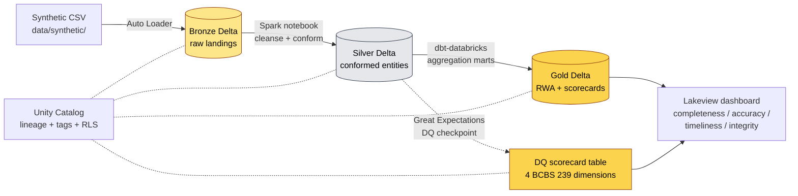

# bcbs239-lakehouse

> **Reference implementation** of the BCBS 239 risk-data-aggregation lakehouse pattern that **Capgemini Risk Data Insights** and **Big-4 BCBS 239 advisory practices** recommend G-SIBs build atop **Databricks Unity Catalog**. Portfolio piece — **synthetic data only**, no production claims.

[](https://github.com/soneeee22000/bcbs239-lakehouse/actions/workflows/ci.yml)
[](LICENSE)
[](https://www.python.org/downloads/)

## What this is (and isn't)

bcbs239-lakehouse is a **2-weekend reference implementation** of the lakehouse substrate every G-SIB Risk Data Office needs to operationalize the data-engineerable subset of BCBS 239's 14 principles — **completeness, accuracy, timeliness, integrity** — on Databricks + Delta Lake + Unity Catalog + dbt-databricks.

It is built as a **portfolio fluency demonstration** for [Pyae Sone Kyaw](https://github.com/soneeee22000)'s freelance Cloud Data Engineer pitch (Paris, SIRET registered). Pair it with [csrd-lake](https://github.com/soneeee22000/csrd-lake) for the full "regulated-data engineer who handles disclosure (CSRD) AND aggregation (BCBS 239) patterns at G-SIBs" story.

It is **NOT**: a vendor replacement, a production system, sold as a product, validated against real G-SIB data, or a substitute for an enterprise data-governance platform. It deliberately uses 2,000 rows of obviously-fake synthetic data (LEIs prefixed `9999`, names like "AcmeBank S.A.").

## Architecture



## Tech stack

| Layer           | Choice                                                    |
| --------------- | --------------------------------------------------------- |
| Compute         | Databricks Community Edition (free, public, reproducible) |
| Storage         | Delta Lake                                                |
| Catalog         | Unity Catalog (lineage + tags + RLS)                      |
| Transformation  | dbt-databricks 1.9                                        |
| Data quality    | Great Expectations 1.3                                    |
| Dashboard       | Databricks Lakeview                                       |
| Languages       | Python 3.12 + SQL                                         |
| Package manager | `uv`                                                      |

## Quick start

```bash
git clone https://github.com/soneeee22000/bcbs239-lakehouse
cd bcbs239-lakehouse
make setup        # uv sync + dev + dbt deps
make synthetic    # generate counterparty/exposure/collateral CSVs
make demo         # full pipeline locally on PySpark, no Databricks needed
make test         # pytest with coverage gate
```

For the live Databricks demo (Unity Catalog + Lakeview), copy `.env.example` to `.env`, fill in your Community Edition token, then:

```bash
make uc-provision
make pipeline
make lakeview-provision
```

## Project structure

```
bcbs239-lakehouse/
├── docs/PRD.md             # source of truth for all features
├── src/bcbs239_lakehouse/
│   ├── data/synthetic.py   # counterparty + exposure + collateral generator
│   ├── quality/dimensions.py  # 4 BCBS 239 DQ dimension scorers
│   └── lineage/assertions.py  # Unity Catalog graph assertions
├── notebooks/              # Databricks notebooks (Bronze, Silver)
├── dbt_project/            # dbt-databricks Gold marts
├── data/synthetic/         # generated CSVs (gitignored)
├── tests/
└── .github/workflows/ci.yml
```

## What's covered, what isn't (BCBS 239 principles)

| Principle                                 | Status | Implementation                                         |
| ----------------------------------------- | ------ | ------------------------------------------------------ |
| #3 Accuracy & integrity                   | ✅     | Great Expectations checkpoints + Lakeview scorecard    |
| #5 Completeness                           | ✅     | Required-field counts + scorecard                      |
| #6 Timeliness                             | ✅     | Snapshot freshness + scorecard                         |
| #4 Integrity (deduplication, conformance) | ✅     | Silver-layer dedup + Lakeview scorecard                |
| #1 Governance, #2 Data architecture & IT  | ❌     | People + organisational; out of scope for any software |
| #7-11 Risk reporting practices            | ❌     | Out of scope (project #3 territory)                    |
| #12-14 Supervisory review                 | ❌     | Out of scope (regulator-side)                          |

## From synthetic to production

A G-SIB engineer wiring this to real source systems would change exactly these surfaces:

| In this repo (synthetic)            | In production (real G-SIB)                                                         |
| ----------------------------------- | ---------------------------------------------------------------------------------- |
| `data/synthetic/counterparty.csv`   | Auto Loader from internal counterparty master S3 / ADLS path                       |
| `data/synthetic/exposure.csv`       | Auto Loader from core banking export drop zone                                     |
| Hard-coded `entity_id` list in seed | Unity Catalog managed table linked to enterprise Legal Entity master               |
| Lakeview dashboard public           | Lakeview dashboard with row-level access policy bound to Risk Data Office UC group |
| Single workspace                    | Multi-workspace deployment with metastore federation                               |

Full mapping in [`docs/PORTABILITY.md`](docs/PORTABILITY.md) (Weekend 2).

## Sibling project

[csrd-lake](https://github.com/soneeee22000/csrd-lake) — same author, Snowflake stack, external CSRD/ESRS disclosure pipeline. Pair for the "regulated-data engineer who handles both inbound aggregation and outbound disclosure" story.

## License

MIT — see [LICENSE](LICENSE).

## Author

[Pyae Sone Kyaw (Seon)](https://github.com/soneeee22000) — Freelance Cloud Data Engineer, Paris (SIRET registered, EU work permit). [LinkedIn](https://linkedin.com/in/pyae-sone-kyaw) · [Portfolio](https://pseonkyaw.dev) · pyaesonekyaw101010@gmail.com
