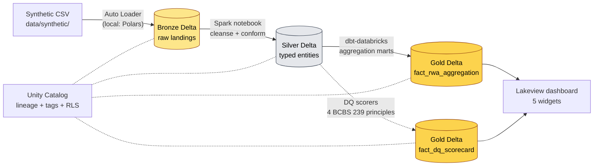

# bcbs239-lakehouse

> **Reference implementation** of the BCBS 239 risk-data-aggregation lakehouse pattern that **Capgemini Risk Data Insights** and **Big-4 BCBS 239 advisory practices** recommend G-SIBs build atop **Databricks Unity Catalog**. Portfolio piece — **synthetic data only**, no production claims.

[](https://github.com/soneeee22000/bcbs239-lakehouse/actions/workflows/ci.yml)
[](LICENSE)
[](https://www.python.org/downloads/)
[](#tests)
[](#tests)
[](https://www.databricks.com/learn/free-edition)

> **Live dashboard:** [bcbs239-lakehouse.vercel.app](https://bcbs239-lakehouse.vercel.app)
> — Next.js companion site reading a committed Gold-layer JSON snapshot.
> Shows the DQ scorecard, the clean-vs-dirty drift table, and the
> medallion-layer row counts. No Databricks credentials needed in deploy.

## What this is (and isn't)

bcbs239-lakehouse is a **2-weekend reference implementation** of the lakehouse substrate every G-SIB Risk Data Office needs to operationalize the data-engineerable subset of BCBS 239's 14 principles — **completeness, accuracy, timeliness, integrity** — on Databricks + Delta Lake + Unity Catalog + dbt-databricks.

It is built as a **portfolio fluency demonstration** for [Pyae Sone Kyaw](https://github.com/soneeee22000)'s freelance Cloud Data Engineer pitch (Paris, SIRET registered). Pair it with [csrd-lake](https://github.com/soneeee22000/csrd-lake) for the full _"regulated-data engineer who handles disclosure (CSRD) AND aggregation (BCBS 239) patterns at G-SIBs"_ story.

It is **NOT** a vendor replacement, **NOT** a production system, **NOT** sold as a product, **NOT** validated against real G-SIB data, and **NOT** a substitute for an enterprise data-governance platform. It deliberately uses 2,000-ish rows of obviously-fake synthetic data (LEIs prefixed `9999`, names like `AcmeBank S.A.`).

## Domain primer (BCBS 239 + RWA in 90 seconds)

**BCBS 239** is a 14-principle Basel Committee regulation from 2013 that requires the world's 30 largest banks (G-SIBs) to demonstrate to regulators that they aggregate risk data **accurately, completely, and on time** across legal entities, risk types, and reporting periods. Of the 14 principles, only **4 have a defensible software surface** — completeness, accuracy, timeliness, and integrity. The other 10 are governance, organisational, and supervisory concerns that no software ships. This project implements the 4 a data engineer can actually build.

**Risk-Weighted Assets (RWA)** is the metric being aggregated. A bank can't say "we have €1bn in loans" — a €1bn loan to the German government is far less risky than a €1bn unsecured SME loan. So Basel says: multiply each exposure by a risk weight reflecting how dangerous it is, then sum.

```
RWA = Σ (exposure_amount × risk_weight)
```

| Asset class                      | Typical risk weight |
| -------------------------------- | ------------------- |
| Cash, AAA government debt        | 0%                  |
| Residential mortgages            | ~35%                |
| Investment-grade corporate loans | 100%                |
| Speculative-grade / distressed   | 150%                |

Banks must hold regulatory capital ≥ a fixed percentage of their RWA (8% under Basel III, plus buffers ≈ 10.5–13%) — so RWA is the **denominator of every capital-adequacy ratio** banks publish. The arithmetic is trivial. The BCBS 239 problem is the **data plumbing**: pulling every exposure across every legal entity, every desk, every system, and rolling it up correctly with auditable lineage when the regulator asks. That is what this lakehouse pattern is for.

### The two-mart pattern: business answer + trust signal

The Gold layer produces two parallel marts. That separation is the BCBS 239 thesis in one design choice:

1. **`fact_rwa_aggregation` — the business answer.** For each (legal entity, exposure type, reporting date), aggregate `amount_eur × risk_weight`. 222 rows on the synthetic data.
2. **`fact_dq_scorecard` — the trust signal.** For the same snapshot, score completeness / accuracy / timeliness / integrity. 10 rows per pipeline run. This is what the Lakeview dashboard and the [Vercel companion site](https://bcbs239-lakehouse.vercel.app) bind to.

Bad rows (negative amounts, out-of-range risk weights) are _still aggregated_ into the business mart — the resulting figures are wrong on dirty data, which is precisely the point: the scorecard quantifies the wrongness independently. A regulator looking at an RWA number wants to see, side by side, how trustworthy the inputs were. That is the BCBS 239 evidence layer.

## Architecture



### Two execution paths

The same Bronze → Silver → Gold logic runs in two equivalent shapes — see [ADR-001](docs/ADR/ADR-001-delta-rs-for-library-path.md):

|                | Library path (`src/`)                     | Databricks runtime path (`notebooks/`)         |
| -------------- | ----------------------------------------- | ---------------------------------------------- |
| Engine         | Polars + `deltalake` (Rust)               | PySpark + `delta-spark`                        |
| Targets        | Local dev + CI                            | Databricks Free Edition / paid workspace       |
| JVM required   | No                                        | Yes (Databricks-runtime managed)               |
| Tests          | 126 / 126 passing locally                 | Verified end-to-end on Free Edition serverless |
| Storage format | Delta Lake (byte-compatible across paths) | Delta Lake                                     |

## Tech stack

| Layer           | Choice                                                                                                               |
| --------------- | -------------------------------------------------------------------------------------------------------------------- |
| Compute         | Databricks Free Edition (free, public, reproducible — replaces Community Edition since 2025)                         |
| Storage         | Delta Lake (delta-rs locally; delta-spark on workspace)                                                              |
| Catalog         | Unity Catalog (lineage + tags + RLS) — provisioned via `databricks-sdk`                                              |
| Transformation  | Polars (locally) / dbt-databricks 1.9 (workspace)                                                                    |
| Data quality    | 4 BCBS 239 principle scorers (`bcbs239_lakehouse.quality.dimensions`); Great Expectations migration planned for v1.1 |
| Dashboard       | Databricks Lakeview (JSON spec at `src/bcbs239_lakehouse/databricks/dashboards/dq_scorecard.json`)                   |
| Languages       | Python 3.12 + SQL                                                                                                    |
| Package manager | `uv`                                                                                                                 |

## Quick start (local — no Databricks workspace needed)

```bash
git clone https://github.com/soneeee22000/bcbs239-lakehouse
cd bcbs239-lakehouse
make setup        # uv sync + dev + dbt deps
make demo         # synthetic -> bronze -> silver -> gold + DQ scorecard print
make test         # pytest with 80% coverage gate
```

### `make demo` output (clean run)

```
-- Layer row counts ------------------------------------------
  bronze   collateral=395, counterparty=100, exposure=311
  silver   counterparty=100, exposure=311, collateral=395
  gold     fact_rwa_aggregation=222, fact_dq_scorecard=10

-- DQ scorecard (latest snapshot) ----------------------------
  source        dimension     score   sample  failed
  collateral    accuracy      1.000   395     0
  collateral    completeness  1.000   395     0
  collateral    integrity     1.000   395     0
  collateral    timeliness    1.000   395     0
  counterparty  completeness  1.000   100     0
  counterparty  integrity     1.000   100     0
  exposure      accuracy      1.000   311     0
  exposure      completeness  1.000   311     0
  exposure      integrity     1.000   311     0
  exposure      timeliness    1.000   311     0
```

### `make inject-defects` (PRD Story 3 — DQ scorecard reacts to dirty data)

```
  source        dimension     score   sample  failed
  collateral    timeliness    0.119   210     185   <- DROP from 1.000
  exposure      accuracy      0.925   159     12    <- DROP from 1.000
  (all unaffected dimensions remain 1.000)
```

This is the smoke-test the recruiter pitch lives or dies on: dirty data must produce _visibly_ degraded scores, and clean data must score 1.000 across every dimension. Both verified end-to-end as part of `make test`.

## Live Databricks demo (Free Edition)

Sign up free at <https://www.databricks.com/learn/free-edition>, then:

```bash
cp .env.example .env       # fill in DATABRICKS_HOST + DATABRICKS_TOKEN
make uc-provision          # catalog + bronze/silver/gold/raw schemas + raw.synthetic volume
make synthetic             # generate clean CSVs locally
make uc-data-upload        # push CSVs to /Volumes/{catalog}/raw/synthetic/
# (Workspace UI: import notebooks/01_bronze.py / 02_silver.py / 03_gold.py and Run all)
make lakeview-provision    # publish the BCBS 239 DQ Scorecard dashboard
```

The defect-injection demo loop (PRD Story 3 — DQ scorecard reacts to upstream
data drift) is one command after the initial deploy:

```bash
make inject-defects && make uc-data-upload && make refresh
```

`make refresh` runs `scripts/refresh_pipeline.py` — the SQL-warehouse
equivalent of running notebooks 01→02→03 sequentially, deterministic and
terminal-driven for CI / scripted demos.

End-to-end walkthrough: [`docs/DEPLOY.md`](docs/DEPLOY.md). Recruiter-pitch
capture order (4 stills + 1 GIF): [`docs/DEMO-SCRIPT.md`](docs/DEMO-SCRIPT.md).

## Project structure

```
bcbs239-lakehouse/
├── docs/
│   ├── PRD.md                     # source of truth for all features
│   ├── DEPLOY.md                  # Free-Edition end-to-end walkthrough
│   ├── DEMO-SCRIPT.md             # recruiter-pitch capture order (4 stills + 1 GIF)
│   ├── PORTABILITY.md             # Databricks <-> Snowflake equivalence matrix
│   └── ADR/
│       └── ADR-001-...md          # delta-rs vs delta-spark split
├── src/bcbs239_lakehouse/
│   ├── data/synthetic.py          # counterparty + exposure + collateral generators
│   ├── pipeline/
│   │   ├── bronze.py              # idempotent CSV -> Delta ingest (Polars + delta-rs)
│   │   ├── silver.py              # typed casts + dedup
│   │   └── gold.py                # RWA aggregation + DQ scorecard mart
│   ├── quality/dimensions.py      # 4 BCBS 239 DQ dimension scorers
│   ├── databricks/
│   │   ├── cli.py                 # provision / upload / lakeview SDK CLI
│   │   ├── unity_catalog.py       # UC catalog/schema/volume/table provisioner
│   │   ├── lakeview.py            # Lakeview dashboard publisher
│   │   └── dashboards/
│   │       └── dq_scorecard.json  # Lakeview spec (table + line trend chart)
│   └── cli.py                     # `make demo` entry point (local pipeline)
├── notebooks/                     # PySpark notebook variants (01_bronze / 02_silver / 03_gold)
├── scripts/
│   └── refresh_pipeline.py        # SQL-warehouse Bronze->Silver->Gold refresh (make refresh)
├── dbt_project/                   # dbt-databricks Gold marts (scaffold; full marts v1.1)
├── data/synthetic/                # generated CSVs (gitignored)
├── tests/                         # 126 tests, 95.30% coverage
└── .github/workflows/ci.yml
```

## What's covered, what isn't (BCBS 239 principles)

| Principle                                | Status | Implementation                                               |
| ---------------------------------------- | ------ | ------------------------------------------------------------ |
| #3 Accuracy & integrity                  | ✅     | `score_accuracy_value_in_range` + Lakeview scorecard         |
| #5 Completeness                          | ✅     | `score_completeness` (required-field non-null) + scorecard   |
| #6 Timeliness                            | ✅     | `score_timeliness` (snapshot freshness) + scorecard          |
| #4 Integrity (deduplication)             | ✅     | `score_integrity_dedup` (natural-key uniqueness) + scorecard |
| #1 Governance, #2 Data architecture & IT | ❌     | People + organisational; out of scope for any software       |
| #7-11 Risk reporting practices           | ❌     | Out of scope (project #3 territory)                          |
| #12-14 Supervisory review                | ❌     | Out of scope (regulator-side)                                |

The 4 implemented principles cover **all the data-engineerable surface** of BCBS 239. The other 10 principles are governance, organisation, and regulator-facing concerns that no software ships.

## From synthetic to production

A G-SIB engineer wiring this to real source systems would change exactly these surfaces:

| In this repo (synthetic)            | In production (real G-SIB)                                                         |
| ----------------------------------- | ---------------------------------------------------------------------------------- |
| `data/synthetic/counterparty.csv`   | Auto Loader from internal counterparty master S3 / ADLS path                       |
| `data/synthetic/exposure.csv`       | Auto Loader from core banking export drop zone                                     |
| Hard-coded `entity_id` list in seed | Unity Catalog managed table linked to enterprise Legal Entity master               |
| Lakeview dashboard public           | Lakeview dashboard with row-level access policy bound to Risk Data Office UC group |
| Single workspace                    | Multi-workspace deployment with metastore federation                               |

Full mapping in [`docs/PORTABILITY.md`](docs/PORTABILITY.md), including the Snowflake-stack swap-out for shops that don't run Databricks.

## Tests

126 tests, **95.30% coverage** on `src/bcbs239_lakehouse/`. Test breakdown:

- `test_smoke.py` — package importability (3 tests)
- `test_synthetic.py` — generator determinism, defect injection, byte-equal CSVs (29 tests)
- `test_quality_dimensions.py` — DQ scorer invariants (17 tests)
- `test_pipeline_bronze.py` — idempotent ingest + metadata preservation (10 tests)
- `test_pipeline_silver.py` — typed casts + dedup (12 tests)
- `test_pipeline_gold.py` — RWA aggregation + DQ scorecard (10 tests)
- `test_cli.py` — end-to-end demo orchestrator (5 tests)
- `test_databricks_cli.py` — CLI driver for provision / upload / lakeview (11 tests)
- `test_databricks_unity_catalog.py` — mocked SDK idempotency (catalog / schema / volume / external table) (13 tests)
- `test_databricks_lakeview.py` — mocked SDK create-or-update + JSON spec validity (5 tests)
- `test_repo_hygiene.py` — killed-phrase anti-regression (8 tests)

CI gates: `ruff check` + `ruff format --check` + `mypy --strict` + pytest with
70% coverage floor (current actual 95.30%).

## Sibling project

[csrd-lake](https://github.com/soneeee22000/csrd-lake) — same author, Snowflake stack, external CSRD/ESRS disclosure pipeline. Pair for the _regulated-data engineer who handles both inbound aggregation and outbound disclosure_ story.

## License

MIT — see [LICENSE](LICENSE).

## Author

[Pyae Sone Kyaw (Seon)](https://github.com/soneeee22000) — Freelance Cloud Data Engineer, Paris (SIRET registered, EU work permit).
[LinkedIn](https://linkedin.com/in/pyae-sone-kyaw) · [Portfolio](https://pseonkyaw.dev) · pyaesonekyaw101010@gmail.com
