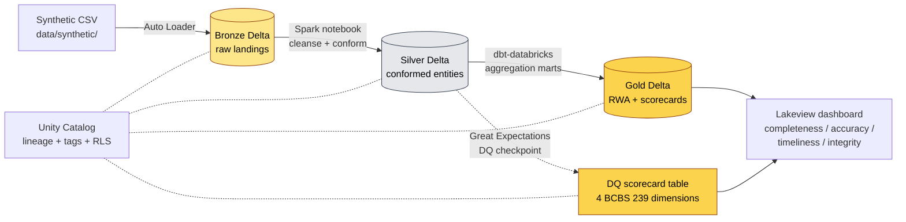

# PRD: bcbs239-lakehouse

> **Status:** Approved (pre-locked via PRFAQ-bcbs239.md)
> **Author:** Pyae Sone Kyaw (Seon)
> **Date:** 2026-05-01
> **Last Updated:** 2026-05-01
> **Intended Scope:** **PORTFOLIO PIECE** (per `MOAT-CHECK-bcbs239.md` — GREEN as portfolio, RED as product). Refuse any vendor-displacement framing in any artifact (README, CV, cover letter, social copy).

---

## 1. Problem Statement

### What problem are we solving?

Risk Data Offices at G-SIBs (the 30 largest banks globally) need to demonstrate to their regulators that they aggregate risk data accurately, completely, and on time across legal entities, risk types, and reporting periods — codified by the Basel Committee as **BCBS 239** (14 principles). Every G-SIB has an active multi-year maturity programme; Big-4 advisory practices and Capgemini Risk Data Insights sell engagements implementing the lakehouse substrate this requires.

bcbs239-lakehouse is **a public reference implementation** of that lakehouse substrate on Databricks Unity Catalog + Delta Lake + dbt-databricks — the same architecture French G-SIBs (BNP, SG, BPCE, CA) build internally and consultants are paid to deliver. It exists as a **portfolio fluency demonstration** for Pyae Sone Kyaw's freelance Cloud Data Engineer pitch routed through Logan Cannon's Paris recruitment agency.

### Who has this problem?

- **G-SIB Risk Data Office engineers** building or running internal BCBS 239 evidence layers — they read this repo to evaluate a freelancer's pattern fluency before a 6-month embed.
- **Big-4 / Capgemini risk-data advisory consultants** subcontracting freelancers onto active G-SIB BCBS 239 programs — they read this repo to confirm the freelancer can write Databricks + dbt-databricks + Unity Catalog code from day one.

### Why now?

1. CSRD-Lake (Snowflake stack) shipped 2026-05-01 — the user needs a Databricks counterpart to diversify the freelance pitch.
2. Logan Cannon (recruiter) explicitly asked for case studies and stack confidence on 2026-05-01; pairing CSRD-Lake (external disclosure) with bcbs239-lakehouse (internal aggregation) gives him two distinct lanes to pitch.
3. BCBS 239 maturity programs are still active at every G-SIB after 13 years of the regulation; Basel 3.1 implementation in 2026 is layered on top of BCBS 239 capability, raising demand for the underlying lakehouse work.

---

## 2. Success Criteria

### Primary Metric

**Logan Cannon, after reading the repo, can pitch the user to a G-SIB Risk Data Office or a Big-4 risk-data subcontract engagement at TJM ≥ 650 €/day with the bcbs239-lakehouse link as the proof point.**

### Secondary Metrics

- [ ] All 4 of 14 BCBS 239 principles selected (completeness, accuracy, timeliness, integrity) operationalize as objective Lakeview scorecards
- [ ] Synthetic dirty-data injection causes scorecards to drop measurably; cleansing causes them to recover
- [ ] Unity Catalog auto-generates Bronze → Silver → Gold lineage; tests assert expected node + edge counts
- [ ] 80%+ test coverage on `src/bcbs239_lakehouse/`
- [ ] Reproducible cold-start in < 15 min from a fresh Databricks Community Edition workspace
- [ ] Anti-regression test fails the build if any killed-claim phrasing appears in any markdown or SQL

### What does "done" look like?

A G-SIB Risk Data engineer (or a Big-4 risk-data consultant) opens `github.com/soneeee22000/bcbs239-lakehouse`, reads the README in under 5 minutes, watches the 30-second walkthrough GIF, sees the Lakeview scorecards reacting to dirty-data injection, and concludes "this person understands BCBS 239 at the data-engineering level — book a call."

---

## 3. User Stories & Acceptance Criteria

### Story 1: Run the end-to-end Bronze → Silver → Gold pipeline on synthetic data

**As a** G-SIB Risk Data engineer evaluating the user, **I want to** run the full pipeline on the bundled synthetic dataset, **so that** I can see the architectural pattern executing on real Databricks compute without any setup beyond my Community Edition workspace.

**Acceptance Criteria:**

- [ ] Given a fresh clone of the repo, when I run `make demo`, then the synthetic data lands in Bronze, conforms in Silver, aggregates in Gold, and Unity Catalog lineage is registered — all in < 15 min on Community Edition.
- [ ] Given the demo completes, when I open the Lakeview dashboard, then the four DQ scorecards display values reflecting the synthetic data's known cleanliness state.
- [ ] Error state: if Databricks credentials are missing, the CLI exits with code 1 and a one-line error pointing to `.env.example`.

### Story 2: Inspect Unity Catalog lineage end-to-end

**As a** Big-4 risk-data consultant, **I want to** see the lineage graph Unity Catalog produces from the pipeline, **so that** I can confirm the user knows which UC features map to which BCBS 239 principles.

**Acceptance Criteria:**

- [ ] Given the pipeline has run, when I query the Unity Catalog REST API for table-level lineage, then I get a graph with the expected Bronze → Silver → Gold edges for `counterparty`, `exposure`, `collateral`.
- [ ] Given lineage exists, when I run `make test`, then `tests/test_lineage_shape.py` asserts the expected node + edge counts match the Mermaid diagram in README.

### Story 3: Watch the DQ scorecards react to dirty-data injection

**As a** G-SIB Risk Data engineer, **I want to** inject known data-quality defects and see the Lakeview scorecards drop, **so that** I can confirm the DQ framework is not theatre.

**Acceptance Criteria:**

- [ ] Given the pipeline is running on clean synthetic data, when I run `make inject-defects`, then the next pipeline run produces lower completeness/accuracy/timeliness/integrity scores and the Lakeview dashboard reflects the drop.
- [ ] Given defects are injected, when I run `make repair-data`, then scorecards recover to baseline within one pipeline run.

### Story 4: Read the "synthetic to production" walkthrough

**As a** Big-4 risk-data consultant, **I want to** see exactly what code I'd change to wire bcbs239-lakehouse to a real G-SIB source system, **so that** I can confirm the user can ramp into a real engagement without hand-holding.

**Acceptance Criteria:**

- [ ] Given I open the README, when I scroll to "From synthetic to production", then I find a side-by-side table mapping every synthetic surface to its real-G-SIB equivalent (Auto Loader paths, UC managed tables, RLS policies, multi-workspace deployment).
- [ ] Given I read the section, when I open `docs/PORTABILITY.md`, then I find a Databricks → Snowflake equivalence matrix for shops on the Snowflake stack.

### Story 5: Anti-regression discipline (killed-claim test)

**As the** project's future maintainer (the user, in a panic before sending the link to a recruiter), **I want to** be physically blocked from reintroducing the killed claims, **so that** no future copy edit can accidentally undo the moat-check discipline.

**Acceptance Criteria:**

- [ ] Given I add the phrase "replaces Collibra" anywhere in any `*.md` or `*.sql`, when I run `make test`, then `tests/test_repo_hygiene.py::test_no_killed_phrasing` fails with the file + line number.
- [ ] Given the killed-phrase set is exhaustive (Collibra, Alation, Atlan, "replaces Capgemini", "replaces Big-4", "production-ready BCBS 239 evidence layer", "% accuracy"), when CI runs, then the test runs as part of the standard pytest invocation.

---

## 4. Technical Architecture

### Stack Decision

| Layer          | Choice                                    | Why                                                                                                                         |
| -------------- | ----------------------------------------- | --------------------------------------------------------------------------------------------------------------------------- |
| Compute        | **Databricks Community Edition**          | Free, public, reproducible. Real Databricks runtime, real Spark, real Unity Catalog (limited tier).                         |
| Storage        | **Delta Lake**                            | Native to Databricks; ACID + time travel + merge-on-read; the lakehouse table format the buyer expects.                     |
| Catalog        | **Unity Catalog**                         | Lineage + tagging + access policies — the BCBS 239 "evidence layer" features. Marketed by Databricks as a BCBS 239 enabler. |
| Transformation | **dbt-databricks 1.9**                    | Same dbt the user proved on CSRD-Lake (Snowflake adapter). Single mental model across both portfolio pieces.                |
| Data Quality   | **Great Expectations**                    | Industry-standard DQ framework with explicit checkpoints. Maps cleanly to BCBS 239 DQ dimensions.                           |
| Dashboard      | **Databricks Lakeview**                   | Native Databricks dashboards; no external deploy. Scorecard widgets out of the box.                                         |
| Languages      | **Python 3.12 + SQL**                     | Same as CSRD-Lake. Type-strict mypy.                                                                                        |
| Orchestration  | **Databricks Workflows** (manual trigger) | Out of scope: external Airflow on top — that's CSRD-Lake's territory.                                                       |
| CI/CD          | **GitHub Actions**                        | ruff + mypy + pytest + dbt-databricks parse + killed-phrase regression test                                                 |
| Package mgr    | **uv**                                    | Same as CSRD-Lake. Fast, lockfile-driven.                                                                                   |

### Architecture Diagram

### Data Model (Key Entities)

| Layer  | Table                   | Purpose                                                        |
| ------ | ----------------------- | -------------------------------------------------------------- |
| Bronze | `counterparty_raw`      | Synthetic counterparty master (raw landing)                    |
| Bronze | `exposure_raw`          | Synthetic credit exposures per counterparty                    |
| Bronze | `collateral_raw`        | Synthetic collateral pledges                                   |
| Silver | `counterparty`          | Cleansed, deduplicated, conformed legal-entity master          |
| Silver | `exposure`              | Cleansed exposures joined to conformed counterparties          |
| Silver | `collateral`            | Cleansed collateral with valuation timestamps                  |
| Gold   | `fact_rwa_aggregation`  | Risk-Weighted Asset aggregation by entity / risk type / period |
| Gold   | `fact_dq_scorecard`     | DQ score per dimension per source per snapshot date            |
| Gold   | `mart_bcbs239_evidence` | Wide table backing the Lakeview dashboard                      |

### Third-Party Dependencies

| Dependency         | Purpose                                                  | Risk Level | Alternative                             |
| ------------------ | -------------------------------------------------------- | ---------- | --------------------------------------- |
| databricks-sdk     | Workspace + Unity Catalog + Lakeview programmatic access | Low        | databricks-cli (deprecated)             |
| pyspark            | Local Spark for tests; matches Databricks runtime        | Low        | pyspark-stubs                           |
| dbt-databricks     | Transformation + lineage + tests                         | Low        | dbt-spark (less feature-complete on UC) |
| great-expectations | DQ checkpoints + scorecards                              | Low        | Soda Core, custom dbt tests             |
| delta-spark        | Local Delta Lake for tests                               | Low        | none                                    |

---

## 5. Edge Cases & Error Handling

| Scenario                               | Expected Behavior                                                | Priority |
| -------------------------------------- | ---------------------------------------------------------------- | -------- |
| Databricks credentials missing         | CLI exits 1; one-line error → `.env.example`                     | P0       |
| Synthetic data file corrupt            | Bronze ingestion fails fast with file path + row number          | P0       |
| Unity Catalog API rate-limited         | Exponential backoff, 3 retries, then surface error               | P1       |
| Lakeview dashboard not yet provisioned | Idempotent provisioning script; safe to re-run                   | P1       |
| dbt model fails                        | Propagates pytest failure with model name + SQL excerpt          | P0       |
| DQ defect injection idempotency        | `make inject-defects` is idempotent; state file tracks injection | P1       |

### Security Considerations

- [ ] No real customer data — synthetic only, asserted by `tests/test_no_real_data.py`
- [ ] Databricks credentials only via env vars (no hardcoded tokens)
- [ ] `.env` gitignored; `.env.example` in repo
- [ ] All synthetic identifiers are obvious fakes (entity names like "AcmeBank S.A.", LEI prefixes start with `9999`)
- [ ] No outbound calls beyond Databricks workspace + UC

---

## 6. Testing Strategy

### Unit Tests (Target: 80%+ coverage on `src/bcbs239_lakehouse/`)

- [ ] `data/synthetic.py` — generator outputs match expected schema + cleanliness profile
- [ ] `quality/dimensions.py` — DQ dimension functions return correct scores on known fixtures
- [ ] `lineage/assertions.py` — Unity Catalog graph assertions
- [ ] Edge cases for each function (empty input, malformed input, mixed clean/dirty)

### Integration Tests

- [ ] Bronze → Silver pipeline on local PySpark + Delta (no Databricks needed)
- [ ] Silver → Gold dbt-databricks parse (no warehouse needed)
- [ ] Defect injection produces measurable score drop
- [ ] Anti-regression: killed-phrase grep across `*.md` and `*.sql`

### What NOT to test

- Real Databricks workspace integration (out of scope; out-of-process E2E is the demo, not the test)
- Lakeview rendering (visual; covered by GIF + screenshots)
- Multi-jurisdiction reporting templates (out of scope per §8)

---

## 7. Milestones & Build Order

### Weekend 1: Foundation + Pipeline (~15 hr)

- [ ] Project scaffolding + configs (this PRD checkpoint)
- [ ] Synthetic data generator (`src/bcbs239_lakehouse/data/synthetic.py`) — counterparty + exposure + collateral with controllable cleanliness
- [ ] Bronze ingestion (Auto Loader pattern, locally testable on PySpark)
- [ ] Silver cleansing + conforming (Spark notebook + matching pytest)
- [ ] Gold aggregation (dbt-databricks marts; parseable locally)
- [ ] Unit tests for synthetic + DQ + lineage modules
- **Gate:** `make demo` runs end-to-end on local PySpark; DQ scorecards show non-zero values; CI green

### Weekend 2: Unity Catalog + DQ + Dashboard + Polish (~15 hr)

- [ ] Unity Catalog provisioning script (idempotent)
- [ ] Great Expectations checkpoints for the 4 DQ dimensions
- [ ] Lakeview dashboard provisioning script
- [ ] Defect injection + repair scripts
- [ ] README with Mermaid diagram + screenshots + 30-sec GIF
- [ ] PORTABILITY.md (Databricks → Snowflake mapping for Snowflake-stack shops)
- [ ] CV update: add bcbs239-lakehouse alongside CSRD-Lake under Lead Project
- **Gate:** All 5 user stories pass; killed-phrase regression test green; coverage ≥ 80 %

### (Out of scope) Weekend 3: would only happen if user wants to extend

- Real-data wiring documentation (sample mappings for FlexCube / OpenLink Findur / OpenWealth schemas)
- Additional 4 BCBS 239 principles (e.g., adaptability, frequency)
- Multi-workspace federation walkthrough

---

## 8. Out of Scope (Explicitly)

- ❌ Real G-SIB data — synthetic only, stated prominently in README
- ❌ Production Databricks workspace deployment — Community Edition only
- ❌ External Airflow / orchestrator on top — Databricks Workflows manual trigger only (CSRD-Lake handles the Airflow story)
- ❌ All 14 BCBS 239 principles — only 4 data-engineerable DQ dimensions in scope
- ❌ Multi-jurisdiction reporting templates (FINREP / COREP / Pillar 3) — different project
- ❌ Stress testing / scenario engines (IFRS 9 ECL territory)
- ❌ Vendor displacement framing — banned by `MOAT-CHECK-bcbs239.md` killed-claim list
- ❌ Any percentage-accuracy claim against a real G-SIB dataset — synthetic disclaimers only

---

## 9. Open Questions

- [ ] Will Unity Catalog Community Edition expose enough lineage features for Story 2 acceptance criteria? Verify within first 2 hours of Weekend 1; fall back to Hive metastore + manual lineage table if not.
- [ ] Is dbt-databricks 1.9 stable on Databricks Community runtime 14.x? Check release notes; pin or downgrade.
- [ ] Does `make demo` need Java installed locally for PySpark? Add Java check to `make setup` if so.

---

## 10. Approval

- [x] **PRD reviewed and understood** — author confirms requirements are clear
- [x] **Architecture approved** — pre-locked via PRFAQ-bcbs239.md
- [x] **Scope locked** — no features added during build without updating this PRD

> **PRD is the source of truth. Every feature, endpoint, and test traces back to a user story above. If it's not in the PRD, it's not getting built.**

---

## Appendix A: Decision Log

- **2026-05-01** Killed-claim discipline locked: no Collibra / Alation / Atlan / Capgemini / Big-4 displacement copy. Approved framing: "reference implementation of the BCBS 239 risk-data-aggregation lakehouse pattern Capgemini Risk Data Insights and Big-4 BCBS 239 advisory practices recommend G-SIBs build atop Databricks Unity Catalog."
- **2026-05-01** Stack decision: Databricks (not Snowflake) explicitly to diversify from CSRD-Lake.
- **2026-05-01** Scope cut: 4 of 14 BCBS 239 principles (the data-engineerable ones).
- **2026-05-01** Demo target: Databricks Community Edition (free, reproducible) — not a paid workspace.
- **2026-05-01** Orchestration cut: no external Airflow — Databricks Workflows only (CSRD-Lake owns the Airflow story).

## Appendix B: Killed Claims (HARD RULE — anti-regression test enforces)

The following phrases MUST NOT appear in any markdown, SQL, Python comment, README, GIF caption, CV bullet, cover-letter line, GitHub project description, or repo topic tag:

1. `replaces Collibra`
2. `replaces Alation`
3. `replaces Atlan`
4. `replaces Capgemini`
5. `replaces Big-4`
6. `production-ready BCBS 239 evidence layer`
7. `production-grade for regulator review`
8. Any percent-accuracy claim against a real (non-synthetic) G-SIB dataset
9. `cheaper than €` followed by a vendor name
10. `Big-4 alternative`

`tests/test_repo_hygiene.py::test_no_killed_phrasing` greps the repo and fails the build if any phrase appears.
